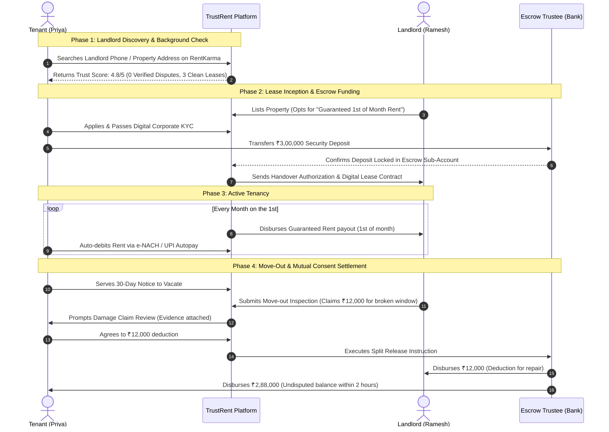
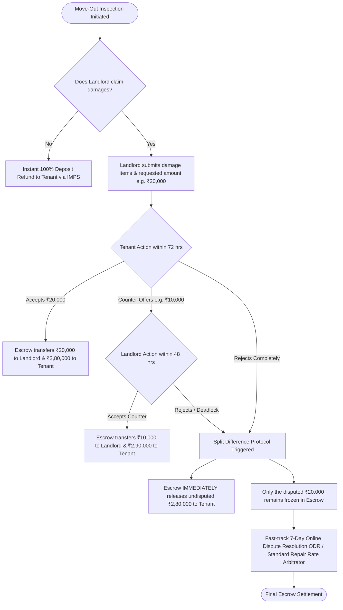
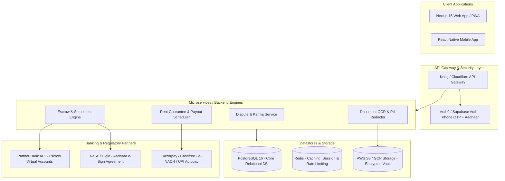

# Product Requirements Document (PRD) & System Architecture
## TrustRent: Tri-Party Rental Escrow & Landlord Dispute Intelligence Platform

**Document Version:** 1.0.0  
**Status:** Approved Architectural Specification  
**Domain:** PropTech / FinTech / LegalTech (India Market Focus)  

---

## 1. Executive Summary & Vision

### 1.1 The Market Malady
In major Indian urban rental hubs (Bengaluru, Mumbai, Gurgaon, Pune, Hyderabad), security deposits range from **₹1,50,000 to ₹4,00,000+** (historically 6 to 10 months of rent). Because landlords hold 100% of this capital in personal bank accounts, a severe power asymmetry exists:
- Landlords routinely deduct **₹50,000 to ₹2,00,000** for routine wear-and-tear, mandatory painting, or fabricated damages.
- Landlords utilize attrition strategies (unresponsive messaging, delaying refunds for 60–90 days) knowing tenants moving to another city or job cannot afford lengthy civil court battles.
- Police frequently dismiss security deposit withholding as a "civil matter," leaving tenants defenseless without formal legal notices or Consumer Forum litigation.

### 1.2 The TrustRent Solution
**TrustRent** is an end-to-end rental integrity platform that eliminates deposit hostage-taking through four integrated pillars:
1. **Landlord Dispute & Reputation Registry ("RentKarma")**: A searchable database of landlords and properties with crowdsourced reports and verified dispute badges backed by redacted proof (rent agreements, bank records, legal notices).
2. **Tri-Party Neutral Rental Escrow ("EscrowVault")**: Deposits are held by an RBI-compliant trustee bank, preventing landlords from unilaterally withholding money without verified mutual consent.
3. **Mutual Consent Settlement & Fair Deduction Engine**: When move-out occurs, legitimate damages are deducted only upon mutual digital consent or standardized mediation; undisputed funds are released instantly.
4. **Landlord Adoption Engine**: Solves the chicken-and-egg supply constraint by offering landlords **Guaranteed Rent on the 1st of every month**, pre-vetted corporate/tech tenants, and **0% brokerage**.

---

## 2. User Personas & Journey Mapping

### 2.1 Personas
```
┌─────────────────────────────────┐   ┌─────────────────────────────────┐
│     The Tenant (Priya, 28)      │   │    The Landlord (Ramesh, 54)    │
│  Senior Software Engineer       │   │  Retired Tech Director, Owner   │
├─────────────────────────────────┤   ├─────────────────────────────────┤
│ • Moving to Bellandur/HSR       │   │ • Owns 3 apartments in Sarjapur │
│ • Has ₹3L locked in deposit     │   │ • Paranoid about rent delays    │
│ • Burned previously by ₹70k     │   │ • Worried about property damage │
│   painting charge deductions    │   │ • Dislikes paying brokers       │
│ • Wants safety & transparency   │   │ • Wants passive, on-time income │
└─────────────────────────────────┘   └─────────────────────────────────┘
```

### 2.2 Core End-to-End User Journey



---

## 3. Core Functional Modules

### 3.1 Module 1: Landlord Dispute & Reputation Registry ("RentKarma")

#### Data Model & Verification Levels
To prevent malicious defamation while surfacing genuine serial abusers, reports are categorized into three trust tiers:

| Tier | Badge | Required Evidence | Verification SLA |
| :--- | :--- | :--- | :--- |
| **Tier 1: Community Review** | `Unverified Community Voice` | Text review, rating, date of tenancy. | Automated profanity & PII scan. |
| **Tier 2: Documented Incident** | `Documented Report` | Redacted rental agreement + Bank transfer statement. | 24-hour document audit. |
| **Tier 3: Verified Legal Dispute** | `Verified Dispute Badge` | Copy of Advocate Legal Notice, Consumer Court (e-Daakhil) filing, or Police GD. | Automated OCR + Manual Legal Paralegal sign-off. |

#### Features:
1. **Search Vectors**: Search by Landlord Mobile Number (salted SHA-256 hash search for privacy), Landlord Full Name, Society/Apartment Name, or Google Place ID.
2. **Right of Reply & Rebuttal**: Landlords can claim their profile via OTP/Aadhaar verification to submit counter-evidence or mark disputes as "Mutually Resolved" upon proof of refund.
3. **Anti-Defamation Defenses**: Automated PII masking (names of family members, personal residential addresses redacted; only property address under dispute is visible).

---

### 3.2 Module 2: Tri-Party Digital Escrow ("EscrowVault")

#### Legal & Regulatory Foundation:
- **Banking Structure**: Escrow accounts are operated in partnership with an RBI-regulated Scheduled Commercial Bank (e.g., ICICI Bank, Axis Bank, IDFC First) and a SEBI-registered Independent Trustee (e.g., Beacon Trusteeship / Catalyst Trusteeship).
- **Tri-Partite Escrow Agreement**: Electronically executed by Tenant, Landlord, and Trustee via Aadhaar e-Sign (NeSL compliant).
- **Fund Segregation**: Tenant deposits do not sit on TrustRent's balance sheet; funds sit in segregated virtual escrow accounts (`ESCROW_SUB_ACC_ID`) mapped to the specific tenancy agreement.

```
       ┌────────────────────────────────────────────────────────┐
       │             Scheduled Commercial Partner Bank           │
       │  ┌──────────────────────────────────────────────────┐  │
       │  │ Master Escrow Pool (Regulated by Trustee Deed)   │  │
       │  └────────────────────────┬─────────────────────────┘  │
       └───────────────────────────┼────────────────────────────┘
                                   │
                 ┌─────────────────┴─────────────────┐
                 ▼                                   ▼
      [Virtual Sub-Account #1]             [Virtual Sub-Account #2]
        Tenant A ──► ₹3,00,000               Tenant B ──► ₹1,50,000
        Lease: #TR-BLR-8921                  Lease: #TR-MUM-4402
```

---

### 3.3 Module 3: Move-Out Settlement & Damage Deduction Engine

#### The "Simple Mutual Consent + Split Difference" Protocol



#### Key Rules:
1. **No Total Hostage-Taking**: If a landlord claims ₹20,000 out of a ₹3,00,000 deposit, the undisputed ₹2,80,000 is **released to the tenant immediately**. The landlord cannot freeze the full deposit over a small dispute.
2. **Itemized Evidence Requirement**: Any claim over ₹2,000 must include timestamped photos of the damage taken during the exit window.
3. **Ordinary Wear & Tear Exclusions**: Standard paint fading, minor screw holes, and routine plumbing washer degradation are contractually pre-defined as landlord responsibilities under the standard lease terms.

---

### 3.4 Module 4: Landlord Supply Engine (Adoption Strategy)

To overcome landlord reluctance to forfeit holding cash deposits, TrustRent provides unmatched landlord value:
1. **Guaranteed Rent on the 1st**: TrustRent advances the monthly rent payout to the landlord on the 1st of every month via instant payout, decoupling landlord cash flow from tenant payment delays.
2. **Pre-Vetted Tech & Corporate Tenants**: Tenants must pass identity verification (Aadhaar KYC + DigiLocker), employment verification (work email/corporate ID verification), and credit checks (CIBIL score > 720).
3. **Zero Brokerage**: Listing and renting through TrustRent is 100% free of broker commissions for landlords.
4. **Verified Trust Landlord Badge**: Landlords accepting Escrow receive high algorithmic visibility and rent their properties in an average of **6 days** compared to the 30–45 day market average.

---

## 4. Technical Architecture & System Design

### 4.1 System Component Overview



---

### 4.2 Database Schema (Prisma ORM Format)

```prisma
datasource db {
  provider = "postgresql"
  url      = env("DATABASE_URL")
}

generator client {
  provider = "prisma-client-js"
}

enum Role {
  TENANT
  LANDLORD
  ARBITRATOR
  ADMIN
}

enum DisputeStatus {
  REPORTED
  EVIDENCE_SUBMITTED
  VERIFIED_LEGAL_NOTICE
  MUTUALLY_RESOLVED
  DISMISSED
}

enum EscrowStatus {
  PENDING_FUNDING
  FUNDED_LOCKED
  MOVE_OUT_INITIATED
  CLAIM_PENDING_REVIEW
  DISPUTED_MEDITATION
  SETTLED_RELEASED
}

model User {
  id              String         @id @default(uuid())
  phoneNumberHash String         @unique // Salted SHA-256 for privacy lookup
  fullName        String
  email           String         @unique
  role            Role           @default(TENANT)
  aadhaarVerified Boolean        @default(false)
  cibilScore      Int?
  karmaScore      Float          @default(100.0) // Reputation score (0-100)
  createdAt       DateTime       @default(now())
  updatedAt       DateTime       @updatedAt

  leasesAsTenant   LeaseAgreement[] @relation("TenantLeases")
  leasesAsLandlord LeaseAgreement[] @relation("LandlordLeases")
  disputeReports   DisputeRecord[]  @relation("ReporterDisputes")
}

model Property {
  id              String           @id @default(uuid())
  addressLine     String
  societyName     String
  city            String
  pincode         String
  googlePlaceId   String?          @index
  currentLandlordId String
  createdAt       DateTime         @default(now())

  disputeRecords  DisputeRecord[]
  leases          LeaseAgreement[]
}

model DisputeRecord {
  id              String        @id @default(uuid())
  propertyId      String
  property        Property      @relation(fields: [propertyId], references: [id])
  reporterId      String
  reporter        User          @relation("ReporterDisputes", fields: [reporterId], references: [id])
  landlordPhoneHash String      @index
  amountWithheld  Decimal       @db.Decimal(12, 2)
  allegedReason   String        // e.g., "Full paint deduction", "Tile replacement"
  status          DisputeStatus @default(REPORTED)
  proofDocumentUrl String?      // Encrypted S3 URL
  isRedacted      Boolean       @default(false)
  landlordRebuttal String?
  createdAt       DateTime      @default(now())
  updatedAt       DateTime      @updatedAt
}

model LeaseAgreement {
  id               String        @id @default(uuid())
  tenantId         String
  tenant           User          @relation("TenantLeases", fields: [tenantId], references: [id])
  landlordId       String
  landlord         User          @relation("LandlordLeases", fields: [landlordId], references: [id])
  propertyId       String
  property         Property      @relation(fields: [propertyId], references: [id])
  
  monthlyRent      Decimal       @db.Decimal(10, 2)
  securityDeposit  Decimal       @db.Decimal(12, 2)
  startDate        DateTime
  endDate          DateTime
  escrowStatus     EscrowStatus  @default(PENDING_FUNDING)
  virtualEscrowAcc String?       @unique // Partner bank virtual account ID
  
  settlementClaims SettlementClaim[]
  createdAt        DateTime      @default(now())
}

model SettlementClaim {
  id                 String       @id @default(uuid())
  leaseId            String
  lease              LeaseAgreement @relation(fields: [leaseId], references: [id])
  claimedDamageAmount Decimal      @db.Decimal(10, 2)
  counterOfferAmount  Decimal?     @db.Decimal(10, 2)
  agreedDeduction    Decimal?     @db.Decimal(10, 2)
  itemizedBreakdown  Json         // [{"item": "broken window", "cost": 3000, "proof": "s3_url"}]
  tenantAgreed       Boolean      @default(false)
  landlordAgreed     Boolean      @default(false)
  isMediationActive  Boolean      @default(false)
  createdAt          DateTime     @default(now())
  updatedAt          DateTime     @updatedAt
}
```

---

### 4.3 Key RESTful API Endpoints

#### 1. Search Landlord Reputation
- **Endpoint**: `GET /api/v1/karma/search?phone={number}&society={name}&city={city}`
- **Response**:
```json
{
  "status": "success",
  "data": {
    "trustScore": 4.2,
    "totalTenanciesRecorded": 5,
    "cleanDepositRefundRate": "80%",
    "disputes": [
      {
        "id": "disp_88921",
        "date": "2025-11-14",
        "amountWithheld": 85000,
        "reason": "Deducted ₹85,000 for full flat repainting after 11 months",
        "status": "VERIFIED_LEGAL_NOTICE",
        "verifiedBadge": true,
        "landlordRebuttal": null
      }
    ]
  }
}
```

#### 2. Create Escrow & Generate Virtual Funding Account
- **Endpoint**: `POST /api/v1/escrow/initialize`
- **Payload**:
```json
{
  "leaseId": "ls_90218",
  "depositAmount": 300000,
  "tenantId": "usr_tenant_1",
  "landlordId": "usr_landlord_9"
}
```
- **Response**:
```json
{
  "escrowId": "esc_4410",
  "status": "PENDING_FUNDING",
  "virtualAccount": {
    "accountNumber": "TRBANK9928192831",
    "ifsc": "ICIC0000104",
    "beneficiaryName": "TRUSTRENT ESCROW TRUSTEE FBO PRIYA SHARMA",
    "validUntil": "2026-10-01T23:59:59Z"
  }
}
```

#### 3. Submit Move-Out Claim & Mutual Settlement
- **Endpoint**: `POST /api/v1/settlement/submit-claim`
- **Payload**:
```json
{
  "leaseId": "ls_90218",
  "claimedDamageAmount": 15000,
  "items": [
    {
      "description": "Cracked bathroom basin",
      "claimedCost": 15000,
      "photoUrls": ["https://vault.trustrent.in/claims/p1.jpg"]
    }
  ]
}
```

#### 4. Accept Settlement / Trigger Split Payout
- **Endpoint**: `POST /api/v1/settlement/respond`
- **Payload**:
```json
{
  "claimId": "clm_7721",
  "action": "ACCEPT_CLAIM" 
}
```
- **Response**:
```json
{
  "status": "SETTLED",
  "payoutSummary": {
    "landlordDisbursed": 15000,
    "tenantRefunded": 285000,
    "transactionReference": "IMPS260982739182",
    "settlementDurationMinutes": 1.4
  }
}
```

---

## 5. Legal, Regulatory & Compliance Framework

### 5.1 RBI Escrow & Trustee Guidelines
1. **Nodal/Escrow Compliance**: Operates under RBI guidelines for intermediary and escrow accounts. TrustRent acts purely as a technology solution provider; funds are controlled exclusively by a SEBI-registered corporate trustee.
2. **Mandate-Based Releases**: Bank releases funds only upon:
   - Bilateral digital sign-off (Tenant OTP + Landlord OTP), OR
   - Certified Order from an empanelled Arbitrator under the Arbitration and Conciliation Act, 1996.

### 5.2 Anti-Defamation & Privacy (DPDP Act 2023)
- **Hashing**: Landlord phone numbers and identities are stored using one-way cryptographic hashes.
- **Redaction Pipeline**: Automatic blurring of Aadhaar numbers, PAN cards, personal account numbers, and third-party names from uploaded evidence before any public display.
- **Notice & Takedown Policy**: Standardized 7-day cure notice provided to landlords before publishing an unverified review, allowing them to refute spurious claims.

---

## 6. Business Model & Unit Economics

| Revenue Stream | Pricing Structure | Payer | Notes |
| :--- | :--- | :--- | :--- |
| **Escrow Transaction Fee** | 0.75% of security deposit (e.g. ₹2,250 on a ₹3L deposit) | Split 50/50 between Tenant and Landlord | One-time per lease agreement. |
| **Float Yield Revenue** | 4.5% – 5.5% p.a. on overnight liquid escrow balances | Bank/Liquid Fund Partner | Revenue generated on ₹3L held for 11–24 months. |
| **Tenant TrustPass (KYC & Verification)** | ₹499 one-time | Tenant | Pre-verified background pack shared with multiple landlords. |
| **Legal Notice & Dispute Resolution Pack** | ₹1,499 per notice | Non-Escrow Users | Automated advocate notice generation for external victims. |

---

## 7. Phased Implementation Roadmap

```
Q1: MVP Launch (RentKarma Registry)
├── Crowdsourced landlord search by phone & society
├── Anonymous dispute submission with PDF/image upload
└── Manual OCR & PII redaction pipeline
    └── Success Metric: 10,000 Landlord ratings in Bengaluru/Gurgaon

Q2: FinTech Escrow Alpha ("EscrowVault")
├── Trustee bank integration (Virtual account generation)
├── Aadhaar e-Sign lease execution
└── Mutual Consent move-out settlement engine
    └── Success Metric: ₹10 Cr GMV locked in secure escrow

Q3: Landlord Growth Engine ("Rent Guarantee")
├── e-NACH / UPI Autopay automated rent collections
├── Guaranteed 1st-of-month rent disbursement to landlords
└── Corporate tech-park tie-ups (Direct employee onboarding)
    └── Success Metric: 500 active managed leases, 0 deposit disputes
```
