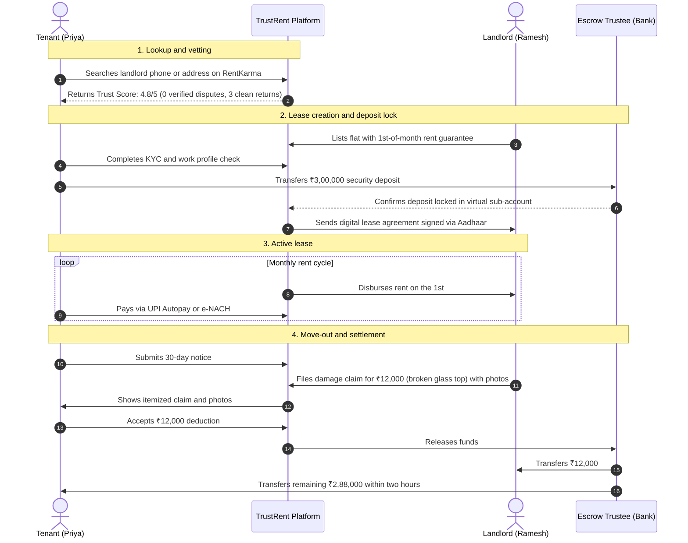
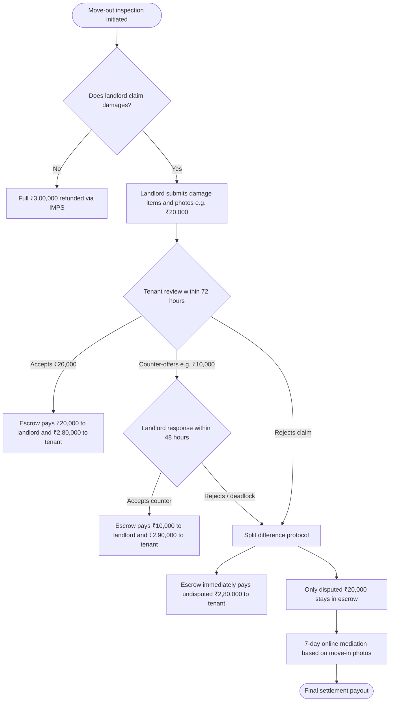
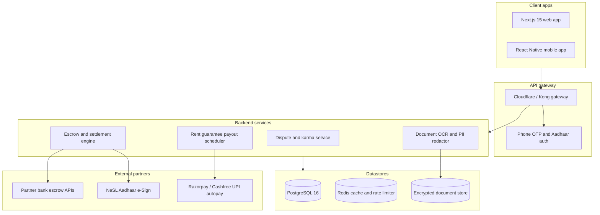

# Product requirements and system architecture
## TrustRent: Rental escrow and landlord dispute records

**Document version:** 1.0.0  
**Status:** Architecture specification  
**Market focus:** India urban rentals (Bengaluru, Mumbai, NCR, Pune, Hyderabad)  

---

## 1. Problem breakdown

### 1.1 Deposit lock-in and arbitrary deductions
In cities like Bengaluru and Mumbai, landlords demand 6 to 10 months of rent upfront as a security deposit (often ₹1,50,000 to ₹4,00,000). Because this money sits in the landlord's personal savings account, tenants lose almost all leverage when moving out:

1. **Repainting and deep cleaning charges:** Landlords routinely cut one full month of rent (₹35,000 to ₹80,000) for repainting, regardless of whether the flat was freshly painted at move-in or only has normal wall wear.
2. **Refurbishment at tenant expense:** Landlords use deposit deductions to replace old plumbing, upgrade cabinets, or fix pre-existing cracks before finding the next tenant.
3. **Refund stalling:** Landlords often take 60 to 90 days to return money. They bet that tenants who have started a new job or moved to another city will give up rather than spend months chasing a ₹50,000 deduction.
4. **Weak legal recourse:** Local police generally treat deposit disputes as civil matters. Civil courts take years, which leaves legal notices or consumer forum filings (e-Daakhil) as the only real options.

### 1.2 What TrustRent does
TrustRent shifts deposit custody away from individual bank accounts and gives tenants public data on landlord refund behavior:
- **RentKarma:** A public registry of landlord dispute histories with search by phone number hash or building address. Reports backed by lease agreements, bank statements, or legal notices receive verified badges.
- **EscrowVault:** A regulated escrow account managed by a trustee bank. Landlords cannot deduct money on their own.
- **Mutual-consent settlements:** When tenants move out, deductions require mutual agreement. Undisputed money returns immediately; only disputed amounts remain frozen for mediation.
- **Landlord acquisition engine:** Solves landlord pushback by offering on-time rent payouts on the 1st of every month, screened tech and corporate tenants, and zero brokerage.

---

## 2. User personas and workflows

### 2.1 Personas

```
┌─────────────────────────────────┐   ┌─────────────────────────────────┐
│     The Tenant (Priya, 28)      │   │    The Landlord (Ramesh, 54)    │
│  Senior Software Engineer       │   │  Property Owner, 3 Flats        │
├─────────────────────────────────┤   ├─────────────────────────────────┤
│ • Relocating to HSR Layout      │   │ • Needs reliable rent on the 1st│
│ • Has ₹3L locked in deposit     │   │ • Fears property damage         │
│ • Lost ₹75,000 to bogus cuts    │   │ • Dislikes dealing with brokers │
│   at previous flat              │   │ • Wants low vacancy downtime    │
│ • Wants proof and safety        │   │ • Wants zero hassle             │
└─────────────────────────────────┘   └─────────────────────────────────┘
```

### 2.2 End-to-end lease workflow



---

## 3. Product modules

### 3.1 RentKarma: dispute registry and background checks

#### Verification levels
To keep reviews honest and prevent fake complaints or defamation, reports fall into three tiers:

| Tier | Tag | Evidence needed | Review process |
| :--- | :--- | :--- | :--- |
| **Tier 1** | Community review | Text review and tenancy dates. | Automated filter for abuse and personal phone numbers. |
| **Tier 2** | Documented report | Redacted rent agreement and bank transfer screenshot. | Document check within 24 hours. |
| **Tier 3** | Verified dispute | Copy of advocate legal notice, police complaint, or e-Daakhil case. | OCR check plus paralegal review. |

#### Core features
1. **Search methods:** Search by salted SHA-256 hash of landlord phone number, landlord name, apartment society name, or Google Place ID.
2. **Landlord rebuttals:** Landlords can claim their profile with Aadhaar OTP to post counter-evidence or show proof that a withheld deposit was refunded.
3. **Privacy protection:** Automated redaction removes personal ID numbers, bank account numbers, and names of family members from uploaded documents. Only the disputed property address remains visible.

---

### 3.2 EscrowVault: third-party deposit holding

#### Banking and legal structure
- **Regulated partner bank:** Escrow accounts operate through an RBI-regulated bank (such as ICICI, Axis, or IDFC First) alongside a SEBI-registered corporate trustee (such as Beacon or Catalyst Trusteeship).
- **Tri-party agreement:** Electronically signed by tenant, landlord, and trustee through NeSL or Digio Aadhaar e-Sign.
- **Virtual sub-accounts:** Tenant deposits never touch TrustRent's corporate accounts. Funds sit in separate virtual accounts tied to each lease agreement.

```
       ┌────────────────────────────────────────────────────────┐
       │             Partner bank master escrow account         │
       │  ┌──────────────────────────────────────────────────┐  │
       │  │ Controlled under trustee mandate                 │  │
       │  └────────────────────────┬─────────────────────────┘  │
       └───────────────────────────┼────────────────────────────┘
                                   │
                 ┌─────────────────┴─────────────────┐
                 ▼                                   ▼
      [Virtual Sub-Account 1]              [Virtual Sub-Account 2]
        Tenant A: ₹3,00,000                  Tenant B: ₹1,50,000
        Lease: TR-BLR-8921                   Lease: TR-MUM-4402
```

---

### 3.3 Move-out settlement engine

#### Settlement rules



#### Core protections
1. **No full deposit freezes:** If a landlord claims ₹20,000 out of a ₹3,00,000 deposit, the undisputed ₹2,80,000 goes back to the tenant immediately. The landlord cannot hold the remaining deposit hostage over a minor repair.
2. **Evidence required:** Claims above ₹2,000 require clear, timestamped photos taken during the move-out window.
3. **Wear and tear excluded:** Paint fading, small picture-hanging nail holes, and aged washers are defined in the lease agreement as standard owner maintenance.

---

### 3.4 Landlord adoption engine

Landlords often prefer holding cash deposits directly. TrustRent gives them three specific reasons to switch:
1. **Rent paid on the 1st:** TrustRent pays the landlord on the 1st of every month, even if the tenant's transfer takes a few extra days to clear.
2. **Pre-screened tenants:** Every tenant passes Aadhaar KYC, corporate email verification, and a CIBIL check (minimum score of 720).
3. **Zero brokerage:** Property listings and lease agreements on TrustRent cost the landlord nothing.
4. **Lower vacancy:** Certified listings rent in an average of 6 days compared to the typical 30 to 45 day market average.

---

## 4. Technical architecture

### 4.1 System components



---

### 4.2 Database schema (Prisma ORM)

```prisma
datasource db {
  provider = "postgresql"
  url      = env("DATABASE_URL")
}

generator client {
  provider = "prisma-client-js"
}

enum Role {
  TENANT
  LANDLORD
  ARBITRATOR
  ADMIN
}

enum DisputeStatus {
  REPORTED
  EVIDENCE_SUBMITTED
  VERIFIED_LEGAL_NOTICE
  MUTUALLY_RESOLVED
  DISMISSED
}

enum EscrowStatus {
  PENDING_FUNDING
  FUNDED_LOCKED
  MOVE_OUT_INITIATED
  CLAIM_PENDING_REVIEW
  DISPUTED_MEDIATION
  SETTLED_RELEASED
}

model User {
  id              String         @id @default(uuid())
  phoneNumberHash String         @unique // Salted SHA-256 hash
  fullName        String
  email           String         @unique
  role            Role           @default(TENANT)
  aadhaarVerified Boolean        @default(false)
  cibilScore      Int?
  karmaScore      Float          @default(100.0) // 0 to 100
  createdAt       DateTime       @default(now())
  updatedAt       DateTime       @updatedAt

  leasesAsTenant   LeaseAgreement[] @relation("TenantLeases")
  leasesAsLandlord LeaseAgreement[] @relation("LandlordLeases")
  disputeReports   DisputeRecord[]  @relation("ReporterDisputes")
}

model Property {
  id                String           @id @default(uuid())
  addressLine       String
  societyName       String
  city              String
  pincode           String
  googlePlaceId     String?          @index
  currentLandlordId String
  createdAt         DateTime         @default(now())

  disputeRecords    DisputeRecord[]
  leases            LeaseAgreement[]
}

model DisputeRecord {
  id                String        @id @default(uuid())
  propertyId        String
  property          Property      @relation(fields: [propertyId], references: [id])
  reporterId        String
  reporter          User          @relation("ReporterDisputes", fields: [reporterId], references: [id])
  landlordPhoneHash String        @index
  amountWithheld    Decimal       @db.Decimal(12, 2)
  allegedReason     String
  status            DisputeStatus @default(REPORTED)
  proofDocumentUrl  String?
  isRedacted        Boolean       @default(false)
  landlordRebuttal  String?
  createdAt         DateTime      @default(now())
  updatedAt         DateTime      @updatedAt
}

model LeaseAgreement {
  id               String        @id @default(uuid())
  tenantId         String
  tenant           User          @relation("TenantLeases", fields: [tenantId], references: [id])
  landlordId       String
  landlord         User          @relation("LandlordLeases", fields: [landlordId], references: [id])
  propertyId       String
  property         Property      @relation(fields: [propertyId], references: [id])
  
  monthlyRent      Decimal       @db.Decimal(10, 2)
  securityDeposit  Decimal       @db.Decimal(12, 2)
  startDate        DateTime
  endDate          DateTime
  escrowStatus     EscrowStatus  @default(PENDING_FUNDING)
  virtualEscrowAcc String?       @unique
  
  settlementClaims SettlementClaim[]
  createdAt        DateTime      @default(now())
}

model SettlementClaim {
  id                  String         @id @default(uuid())
  leaseId             String
  lease               LeaseAgreement @relation(fields: [leaseId], references: [id])
  claimedDamageAmount Decimal        @db.Decimal(10, 2)
  counterOfferAmount  Decimal?       @db.Decimal(10, 2)
  agreedDeduction     Decimal?       @db.Decimal(10, 2)
  itemizedBreakdown   Json
  tenantAgreed        Boolean        @default(false)
  landlordAgreed      Boolean        @default(false)
  isMediationActive   Boolean        @default(false)
  createdAt           DateTime       @default(now())
  updatedAt           DateTime       @updatedAt
}
```

---

### 4.3 API endpoints

#### Search landlord dispute history
- **Path:** `GET /api/v1/karma/search?phone={number}&society={name}&city={city}`
- **Sample response:**
```json
{
  "status": "success",
  "data": {
    "trustScore": 4.2,
    "totalTenanciesRecorded": 5,
    "cleanDepositRefundRate": "80%",
    "disputes": [
      {
        "id": "disp_88921",
        "date": "2025-11-14",
        "amountWithheld": 85000,
        "reason": "Deducted ₹85,000 for repainting after 11 months",
        "status": "VERIFIED_LEGAL_NOTICE",
        "verifiedBadge": true,
        "landlordRebuttal": null
      }
    ]
  }
}
```

#### Initialize escrow account
- **Path:** `POST /api/v1/escrow/initialize`
- **Request payload:**
```json
{
  "leaseId": "ls_90218",
  "depositAmount": 300000,
  "tenantId": "usr_tenant_1",
  "landlordId": "usr_landlord_9"
}
```
- **Sample response:**
```json
{
  "escrowId": "esc_4410",
  "status": "PENDING_FUNDING",
  "virtualAccount": {
    "accountNumber": "TRBANK9928192831",
    "ifsc": "ICIC0000104",
    "beneficiaryName": "TRUSTRENT ESCROW TRUSTEE FBO PRIYA SHARMA",
    "validUntil": "2026-10-01T23:59:59Z"
  }
}
```

#### Submit move-out damage claim
- **Path:** `POST /api/v1/settlement/submit-claim`
- **Request payload:**
```json
{
  "leaseId": "ls_90218",
  "claimedDamageAmount": 15000,
  "items": [
    {
      "description": "Cracked bathroom basin",
      "claimedCost": 15000,
      "photoUrls": ["https://vault.trustrent.in/claims/p1.jpg"]
    }
  ]
}
```

#### Accept settlement and trigger payout
- **Path:** `POST /api/v1/settlement/respond`
- **Request payload:**
```json
{
  "claimId": "clm_7721",
  "action": "ACCEPT_CLAIM" 
}
```
- **Sample response:**
```json
{
  "status": "SETTLED",
  "payoutSummary": {
    "landlordDisbursed": 15000,
    "tenantRefunded": 285000,
    "transactionReference": "IMPS260982739182",
    "settlementDurationMinutes": 1.4
  }
}
```

---

## 5. Regulatory compliance

### 5.1 Escrow accounts under RBI guidelines
TrustRent operates as a technology service provider. All client funds sit directly with an RBI-regulated bank and a SEBI-registered corporate trustee. Funds move out of the escrow sub-accounts only when:
- Both tenant and landlord provide OTP verification in the app, or
- An appointed independent mediator provides a binding decision.

### 5.2 Privacy and the DPDP Act 2023
- Phone numbers and identifying details are stored as one-way salted hashes.
- Aadhaar numbers, personal bank numbers, and family names are blurred out before documents appear publicly.
- Landlords receive a 7-day notification to respond to or clarify reviews before they appear on the public registry.

---

## 6. Business model

| Stream | Fee | Paid by | Details |
| :--- | :--- | :--- | :--- |
| **Escrow transaction fee** | 0.75% of deposit (e.g. ₹2,250 on a ₹3L deposit) | Split equally between tenant and landlord | One-time charge per lease. |
| **Float income** | 4.5% to 5.5% annual return on overnight balances | Banking partner | Interest on deposit money held during the tenancy. |
| **Tenant verification report** | ₹499 | Tenant | Reusable verified background pack showing KYC and CIBIL score. |
| **Legal notice generator** | ₹1,499 | External tenants | Formatted legal notice sent by a partner advocate for non-escrow disputes. |

---

## 7. Rollout plan

### Phase 1: RentKarma launch
- Search landlords by phone number hash and society name.
- Review upload flow with document redaction.
- Target: 10,000 landlord ratings across Bengaluru and Gurgaon.

### Phase 2: Escrow pilot
- Virtual account generation with partner bank.
- Aadhaar e-sign lease agreements.
- Mutual-consent move-out settlements.
- Target: ₹10 Cr deposit value secured across 100 beta flats in Bengaluru.

### Phase 3: Rent guarantee
- Rent advance payout on the 1st of each month.
- Automated UPI Autopay and e-NACH collections.
- Partnerships with tech companies to onboard employees directly.
- Target: 500 active leases with zero deposit withholding disputes.
