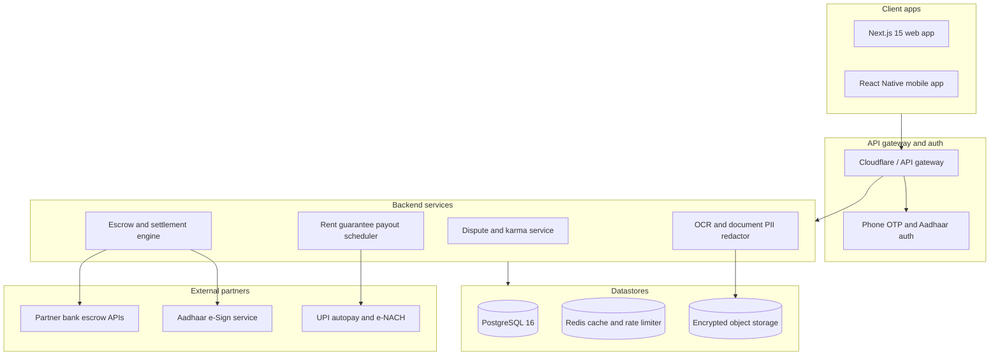

# TrustRent

Rental escrow, landlord dispute records, and mutual-consent deposit settlements.

[](LICENSE)
[](PRD_AND_SYSTEM_ARCHITECTURE.md)

---

## The problem

In cities like Bengaluru, Mumbai, and Gurgaon, landlords routinely take 6 to 10 months of rent upfront as a security deposit (often ₹1.5L to ₹4L). 

When a tenant decides to move out, the landlord holds all the leverage. Deductions of ₹40,000 to ₹1,00,000 for full repainting, deep cleaning, or ordinary wear and tear are standard practice. Many landlords delay refunds for months because they know outgoing tenants have new jobs, new leases, and zero time to spend in court over ₹60,000. Local police stations usually turn tenants away, calling it a civil matter.

---

## How TrustRent works

TrustRent handles deposits through neutral escrow accounts and gives tenants public data on landlords who withhold money.

```
                                  TRUSTRENT PLATFORM
  ┌───────────────────────────┐                        ┌───────────────────────────┐
  │   RentKarma Registry      │                        │       EscrowVault         │
  │ • Search by phone/address │                        │ • Regulated trustee bank  │
  │ • Redacted proof uploads  │                        │ • Deposit stays locked    │
  │ • Verified dispute tag    │                        │ • Fast partial refunds    │
  └─────────────┬─────────────┘                        └─────────────┬─────────────┘
                │                                                    │
                └───────────────────────┬────────────────────────────┘
                                        ▼
                   ┌───────────────────────────────────────────┐
                   │        Move-out settlement engine         │
                   │ • Both parties sign off on deductions     │
                   │ • Legitimate damage paid from deposit     │
                   │ • Undisputed balance returned same day    │
                   │ • Landlord gets guaranteed rent on 1st    │
                   └───────────────────────────────────────────┘
```

### 1. RentKarma: public dispute lookup
Tenants can check a landlord's record by phone number hash or building address before signing a lease. Any tenant can file a review, but reports backed by redacted proof (lease agreements, bank debit statements, or legal notices) get a verified tag. Landlords can claim their profile to post proof of refund or file rebuttals.

### 2. EscrowVault: third-party deposit holding
Instead of sending ₹3,00,000 to a landlord's personal savings account, the deposit sits in an RBI-compliant trustee bank sub-account. The landlord cannot unilaterally touch the principal during or after the tenancy.

### 3. Mutual-consent move-out settlements
If an appliance or fixture breaks, the landlord submits photos and an invoice. If both sides agree on the cost, that exact amount goes to the landlord and the rest returns to the tenant within hours. 

If there is a disagreement over ₹15,000 of damage, the platform does not freeze the full ₹3,00,000. It returns the undisputed ₹2,85,000 to the tenant immediately. Only the disputed ₹15,000 remains locked while an independent mediator reviews the move-in photos.

### 4. Landlord incentives
Landlords usually resist escrow because they like holding cash. To get them to adopt TrustRent:
- TrustRent guarantees rent payment on the 1st of every month, even if tenant bank transfers are delayed.
- Landlords get pre-screened tenants with verified work profiles, Aadhaar KYC, and CIBIL scores above 720.
- Zero brokerage fees.

---

## Architecture overview



---

## Documentation

Read the full technical specification in [PRD_AND_SYSTEM_ARCHITECTURE.md](PRD_AND_SYSTEM_ARCHITECTURE.md):
- Trustee banking and legal structure under Indian law
- PostgreSQL and Prisma schema
- Complete REST API routes and payload contracts
- Unit economics and rollout roadmap

---

## License

MIT License. See [LICENSE](LICENSE) for details.
