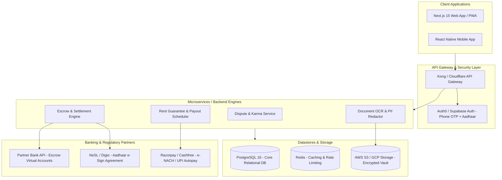

# TrustRent 🛡️
> **Tri-Party Rental Escrow, Landlord Dispute Intelligence ("RentKarma"), & Mutual Consent Settlement Platform**

[](LICENSE)
[](PRD_AND_SYSTEM_ARCHITECTURE.md)
[](#)

---

## 📌 The Problem: The Security Deposit Hostage Trap

In major urban rental markets in India (Bengaluru, Mumbai, Gurgaon, Pune, Hyderabad), security deposits historically range from **₹1,50,000 to ₹4,00,000+** (6 to 10 months of rent).

Because landlords hold 100% of this capital in personal savings accounts, a severe power asymmetry exists:
- **Bogus Painting & Repair Deductions**: Landlords routinely deduct **₹50,000 to ₹1,50,000** for routine wear-and-tear or fabricated damages to subsidize property renovation for subsequent tenants.
- **The "Attrition Game"**: Landlords delay deposit refunds for 60–90 days with excuses ("out of town", "contractor estimate pending"), knowing that the tenant who has relocated to a new flat cannot afford a multi-year civil court battle.
- **Police & Legal Friction**: Local police routinely classify deposit withholding as a "civil matter," leaving tenants defenseless without formal legal notices or Consumer Court filings.

---

## 🚀 The TrustRent Solution

TrustRent restores trust and financial fairness to urban renting via four core pillars:

```
                                  TRUSTRENT PLATFORM
  ┌───────────────────────────┐                        ┌───────────────────────────┐
  │   RentKarma Registry      │                        │       EscrowVault         │
  │ • Landlord Phone/GPS Search│                        │ • RBI Trustee Bank Model  │
  │ • Redacted Legal Proof    │                        │ • ₹3L Deposit Locked      │
  │ • "Verified Dispute" Badge│                        │ • Undisputed Fast Payout  │
  └─────────────┬─────────────┘                        └─────────────┬─────────────┘
                │                                                    │
                └───────────────────────┬────────────────────────────┘
                                        ▼
                   ┌───────────────────────────────────────────┐
                   │    Move-Out Settlement & Landlord Engine  │
                   │ • Simple Mutual Consent / Split Protocol  │
                   │ • Legitimate Damage Deduction from Escrow │
                   │ • Guaranteed 1st-of-Month Rent to Landlord│
                   │ • 0% Brokerage + Pre-Vetted Tech Tenants  │
                   └───────────────────────────────────────────┘
```

1. **RentKarma (Landlord Dispute & Reputation Registry)**:
   - Search by landlord mobile number hash, name, or building/society.
   - Crowdsourced reports with an option to upload redacted proof (rental agreements, bank debit proof, legal notices) to earn a **"Verified Dispute"** badge.
2. **EscrowVault (Tri-Party Digital Escrow)**:
   - Security deposits are locked in an RBI-compliant trustee bank sub-account.
   - Landlords cannot unilaterally siphon funds.
3. **Move-Out Mutual Consent Settlement**:
   - **Fair Damage Deductions**: If something is genuinely damaged, the landlord submits itemized photo proof; upon tenant agreement, the exact amount is deducted from the deposit and paid to the landlord.
   - **No Full-Deposit Hostage**: If a landlord claims ₹15,000 damage out of a ₹3,00,000 deposit, the undisputed ₹2,85,000 is **released to the tenant immediately**. Only the disputed ₹15,000 remains frozen pending mediation.
4. **Landlord Adoption Flywheel**:
   - Landlords get **Guaranteed Rent on the 1st of every month** (advanced before tenant autopay clears).
   - Access to pre-vetted corporate/tech tenants (Aadhaar KYC + work email + CIBIL > 720).
   - **0% Brokerage fees**.

---

## 📖 Detailed Documentation

- **Full Product Requirements Document (PRD)**: [PRD_AND_SYSTEM_ARCHITECTURE.md](PRD_AND_SYSTEM_ARCHITECTURE.md)
  - Detailed User Personas & Journey Maps
  - Banking & Regulatory Structure (RBI Intermediary / Escrow Guidelines & SEBI-registered trustees)
  - Complete PostgreSQL / Prisma ORM Database Schema
  - RESTful API Specifications
  - Unit Economics & Monetization Strategy
  - Phased Implementation Roadmap

---

## 🛠️ System Architecture



---

## 📜 License

MIT License. See [LICENSE](LICENSE) for details.
